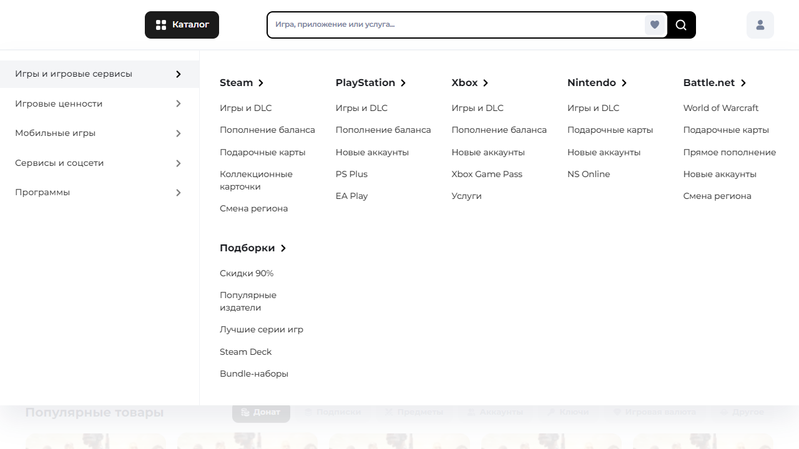
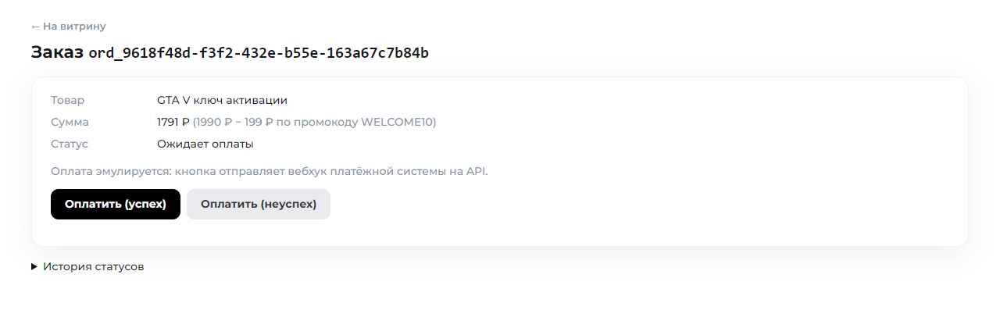
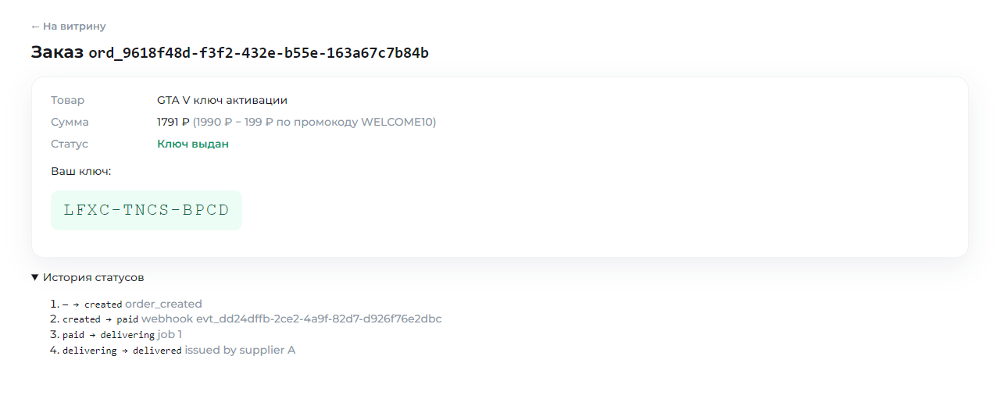
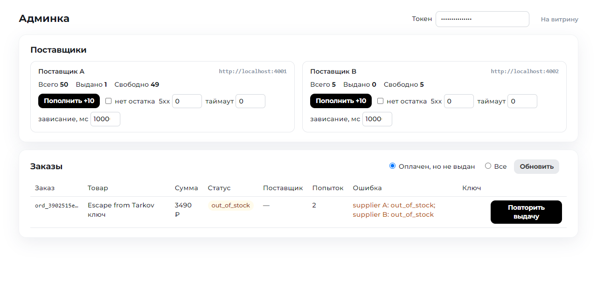

# GGSel MVP — магазин цифровых товаров с однократной выдачей ключей

MVP витрины и продажи цифровых товаров: витрина по макету + флоу «заказ → оплата (вебхук-заглушка) → выдача ключа из пула → статус заказа» с гарантией однократной выдачи под гонками и восстановлением после сбоев.

Бриф и скриншоты макета: [docs/brief/](docs/brief/). Ключевые решения: [docs/decisions.md](docs/decisions.md). Сценарии гонок: [docs/races.md](docs/races.md). Учёт времени: [TIMELOG.md](TIMELOG.md).

## Скриншоты

Витрина по макету: баннер-карусель, ряд сервисов, блок пополнения Steam, чипы и карточки с hover.


Открытое меню «Каталог»: закрывается повторным кликом, кликом вне меню или Esc.



Страница заказа до оплаты: промокод применён, скидку посчитал сервер.



После оплаты: ключ выдан, история переходов `created → paid → delivering → delivered`.



Админка: заказ «оплачен, но не выдан» после отказа обоих поставщиков, кнопка безопасной повторной выдачи и управление заглушками поставщиков.



## Что сделано и где смотреть

| Этап / критерий | Что сделано | Где смотреть |
|---|---|---|
| Этап 1. Витрина | Шапка, баннер-карусель, ряд сервисов, блок пополнения Steam, чипы, ряд карточек по макету; 5 интерактивов | [frontend/index.html](frontend/index.html), [frontend/css/](frontend/css/), [frontend/js/](frontend/js/) |
| Этап 1. Флоу | Заказ → оплата (вебхук-заглушка) → выдача из пула поставщика → страница статуса | [services/orders.js](backend/src/services/orders.js), [services/payments.js](backend/src/services/payments.js), [services/delivery.js](backend/src/services/delivery.js), [order.html](frontend/order.html) |
| Этап 2. Гонки | Идемпотентность по `event_id`, CAS-переходы, одна задача на заказ, вебхук раньше заказа | раздел «Как обеспечена однократная выдача», [scripts/race.mjs](scripts/race.mjs), [backend/test/races.test.js](backend/test/races.test.js) |
| Этап 3. Сбои | Таймаут ≠ отказ, fallback A → B с привязкой к поставщику, `out_of_stock` / `delivery_failed` восстановимы, админка с идемпотентным reissue | [services/delivery.js](backend/src/services/delivery.js), [routes/admin.js](backend/src/routes/admin.js), [admin.html](frontend/admin.html), [backend/test/recovery.test.js](backend/test/recovery.test.js) |
| Этап 4. Промокод | Атомарный лимит, скидка считается сервером, возврат при неуспешной оплате | [services/promo.js](backend/src/services/promo.js), [backend/test/promo.test.js](backend/test/promo.test.js) |
| Критерий 1. 50 параллельных `paid` | 1 выдача, 1 ключ списан | R1 в `npm run race`, тест R1 |
| Критерий 2. Повтор `event_id` | ничего не меняет | R2 |
| Критерий 3. Вебхук раньше заказа / не по порядку | без потери и дубля | R3, R4, R5b |
| Критерий 4. Пустой пул → пополнение → повторная выдача | восстановимый статус, ровно 1 ключ | R6, хаос-стресс RS |
| Критерий 5. Промокод под гонкой | не больше N применений | R8, R9, R9b |

## Запуск

Нужен Node.js 22.13+ (используется встроенный `node:sqlite`, нативных зависимостей нет).

```
npm install
npm run dev
```

Поднимаются три процесса: API на http://localhost:3300 (оттуда же отдаётся фронт), поставщик A на 4001, поставщик B на 4002. Переменные окружения необязательны, их список с дефолтами в [.env.example](.env.example).

Через Docker:

```
docker compose up --build
```

Сбросить базы (при остановленных процессах): `npm run reset`.

Проверка руками:

```
curl localhost:3300/api/products
curl -X POST localhost:4001/issue -H 'content-type: application/json' -d '{"request_id":"req_1","sku":"KEY-GTA5","order_id":"ord_1"}'
curl localhost:4001/stats
```

## Структура

```
frontend/   витрина, страница заказа, админка (HTML / CSS / JS без фреймворков)
backend/    REST API, SQLite, воркер выдачи (Node.js + Express)
suppliers/  две заглушки поставщиков по контракту: /issue, /restock, /chaos, /stats
scripts/    dev.mjs (три процесса), reset-db.mjs, race.mjs (сценарии гонок)
docs/       бриф, решения, сценарии гонок
```

## Витрина

Верстка по макету: шапка, баннер-карусель, ряд сервисов, блок пополнения Steam, чипы категорий и один ряд карточек. Без фреймворков и сборки: HTML, CSS по секциям в [frontend/css/](frontend/css/), ES-модули в [frontend/js/](frontend/js/). Ассеты (иконки, картинки, форма баннера с вырезом) экспортированы из макета в [frontend/assets/](frontend/assets/). Шрифт Montserrat подключён с Google Fonts.

Интерактив из брифа:

1. Баннер: автопрокрутка, стрелки, кликабельные точки-индикаторы, пауза при наведении.
2. Кнопка «Каталог»: открывает меню, повторный клик, клик вне меню или Esc закрывают.
3. Переключатель валют `$ / ₸ / ₽`: меняет активное состояние, пересчёта нет по брифу.
4. Иконки сервисов: плавное выделение при наведении, клик переключает активный.
5. Карточки: подъём, тень и обводка при наведении. Кнопка «Купить» создаёт заказ и ведёт на страницу статуса.

Страница заказа `order.html` и админка `admin.html` в рабочем виде без дизайна.

## API

| Метод | Путь | Назначение |
|---|---|---|
| GET | `/api/products` | каталог |
| POST | `/api/orders` | `{order_id, sku, promo_code?}` → заказ. `order_id` вида `ord_<uuid>` генерирует клиент, повтор с тем же id возвращает тот же заказ (`200` вместо `201`). Скидку считает сервер |
| GET | `/api/orders/:id` | заказ и история переходов; `key_code` виден только в статусе `delivered` |
| POST | `/api/promo/preview` | `{sku, code}` → скидка и итог без списания |
| POST | `/api/orders/:id/promo` | `{code}` применить промокод к неоплаченному заказу; `409 promo_exhausted`, `promo_already_applied`, `order_not_editable` |
| POST | `/api/orders/:id/pay?result=success\|failed` | эмулятор платёжки: формирует событие и шлёт его на `/webhook/payment` по HTTP |
| POST | `/webhook/payment` | вебхук по контракту: `{event_id, order_id, status, amount, currency, created_at}`. Всегда `200`, в ответе `result`: `applied`, `duplicate`, `ignored`, `pending_order`, `amount_mismatch` |
| GET | `/api/admin/orders?recoverable=1` | «оплачен, но не выдан» (`out_of_stock`, `delivery_failed`); без параметра все заказы. Заголовок `x-admin-token` |
| POST | `/api/admin/orders/:id/reissue` | безопасная повторная выдача: `queued`, `already_queued`, `409 not_recoverable` |
| GET | `/api/admin/suppliers` | статистика пулов A и B |
| GET, POST | `/api/admin/promocodes` | список с счётчиками использований; создание `{code, type, value, max_uses}` |
| POST | `/api/admin/suppliers/:name/restock`, `.../chaos` | прокси к заглушке поставщика: пополнить пул, включить режим сбоев |

Поставщики (`4001` A, `4002` B): `POST /issue`, `POST /restock {count | keys}`, `POST /chaos {fail_rate, timeout_rate, hang_ms, out_of_stock}`, `GET /stats`.

Админка: http://localhost:3300/admin.html, токен из `ADMIN_TOKEN` (по умолчанию `admin-dev-token`). Показывает восстановимые заказы, кнопку «Повторить выдачу» и карточки поставщиков с пополнением и переключателями сбоев.

Статусы заказа: `created → paid → delivering → delivered`, ветки `payment_failed`, `out_of_stock`, `delivery_failed`. Переходы описаны в [backend/src/domain/statuses.js](backend/src/domain/statuses.js).

## Как воспроизвести проверку гонок

Два способа, оба без ручных шагов.

**Против живого стенда.** В одном терминале `npm run dev`, в другом:

```
npm run race
RACE_REPEAT=10 npm run race
```

Скрипт [scripts/race.mjs](scripts/race.mjs) создаёт свои заказы, бьёт по API параллельными запросами и печатает по строке на сценарий. Сценарии R6–R7 и хаос-стресс включают режимы сбоев у заглушек через `/chaos` и снимают их после себя. В конце проверяется инвариант: у поставщиков A и B списано ровно столько ключей, сколько заказов доведено до `delivered`. Сценарии описаны в [docs/races.md](docs/races.md).

**В процессе теста.** `npm test` поднимает API с БД в памяти и заглушки поставщиков A и B на случайных портах и прогоняет те же сценарии плюс сбои поставщиков (таймаут, 5xx, пустой пул, недоступный хост, fallback, повторная выдача). Около 2 секунд, 34 теста.

Оба варианта запускаются в CI: [.github/workflows/ci.yml](.github/workflows/ci.yml).

## Как обеспечена однократная выдача

- **Вебхук идемпотентен по `event_id`.** Таблица `webhook_events` с первичным ключом `event_id`, вставка через `INSERT OR IGNORE`. Повтор события даёт `duplicate` и ничего не меняет.
- **Переход статуса это compare-and-set.** `UPDATE orders SET status='paid' WHERE id=? AND status='created'`. Под гонкой из 50 одинаковых вебхуков строку меняет ровно один, и только он ставит задачу на выдачу. Все переходы идут через одну функцию с таблицей разрешённых переходов, поэтому `failed` после `paid` и любые события к финальным заказам игнорируются.
- **Одна задача на заказ.** `delivery_jobs.order_id UNIQUE`, воркер захватывает задачу тем же CAS `queued → running`.
- **`request_id` фиксируется при создании заказа, до вызова поставщика.** Поставщик по контракту обязан вернуть тот же код на тот же `request_id`, поэтому таймаут не равен отказу: повтор после таймаута, рестарта или ручной повторной выдачи получает уже выданный ключ, а не новый.
- **Привязка к поставщику.** Имя поставщика пишется в заказ до вызова и снимается только после его явного отказа. Если ответ не пришёл, заказ остаётся привязан, и повторная выдача продолжает с него же, а не идёт к резервному за вторым ключом. К B переходим только после явного 4xx/5xx от A.
- **`order_id` генерирует клиент.** Двойной клик «Купить» и вебхук, пришедший раньше заказа, сводятся к одному механизму: повторная вставка игнорируется, отложенные события применяются в транзакции создания заказа.
- **Хранилище синхронное.** Встроенный `node:sqlite` выполняет транзакцию целиком, конкурентные записи внутри процесса сериализуются без внешних блокировок.

## Промокоды

Лимит держится на одном выражении `UPDATE promocodes SET used = used + 1 WHERE code = ? AND used < max_uses`: под гонкой из 50 заказов его выполнят ровно `max_uses`. Использование привязано к заказу в `promo_usages`, поэтому повтор создания заказа с тем же `order_id` не списывает второй раз, а неуспешная оплата возвращает использование ровно один раз. Скидку считает сервер по коду и цене товара, присланные клиентом суммы игнорируются; вебхук с суммой, не равной сумме заказа, не применяется. Код можно передать при создании заказа или применить на странице заказа до оплаты.

## Что осталось за рамками

- Один процесс API: горизонтальное масштабирование потребовало бы Postgres, логика CAS-переходов при этом не меняется.
- Повторная выдача только ручная через админку; фоновый ретрай с лимитом попыток добавляется тем же `enqueueOrRequeue` по таймеру.
- Неоплаченные заказы держат использование промокода до `payment_failed`; в проде их снимал бы TTL.
- Подпись вебхука, реальный эквайринг, авторизация пользователей, мобильная и тёмная версии не делались по брифу.

## Время

Фактически 8 часов, разбивка по этапам в [TIMELOG.md](TIMELOG.md).
